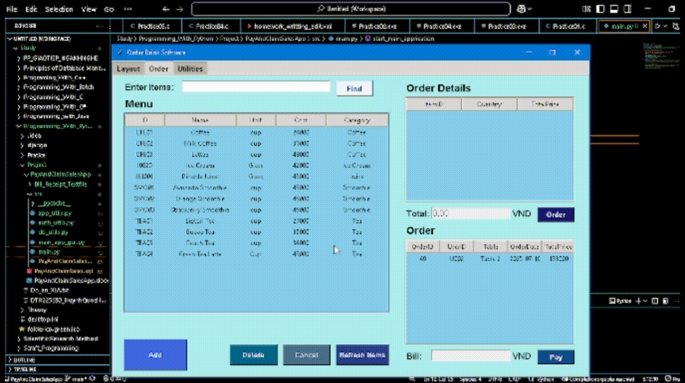

Hiện tiến trình tư duy
Here's the English version of your README.md file, incorporating the requested enhancements, icons, and improved structure, along with the updated instructions for running src/main.py.

# ✨ Pay&Claim-Sales-App-Python-Tkinter ✨

<p align="center">
  
  
  
  
</p>

## 🚀 Project Overview

This repository hosts a desktop application built with Python's Tkinter library, meticulously designed to streamline sales and order management for small businesses and retail environments. It offers an intuitive graphical interface for staff to efficiently handle item orders, meticulously track sales, and generate receipts. The application seamlessly integrates with a MySQL database, ensuring robust data storage and retrieval. Furthermore, it incorporates a comprehensive authentication system to meticulously manage user access and roles.

## 🌟 Application Visualization

<p align="center">
  <h3>Smooth Order Processing! 🧾</h3>
  
  <br>
  <em>The complete order processing flow, from selecting products to finalized payment.</em>
</p>

<p align="center">
  <h3>Secure Login & Signup 🔑</h3>
  
  <br>
  <em>Securely sign up and log in to accounts with Bcrypt for password hashing, ensuring maximum safety.</em>
</p>

<p align="center">
  <h3>Effortless Item Management 🛠️</h3>
  
  <br>
  <em>Quickly add, update, and delete inventory items.</em>
</p>

<p align="center">
  <h3>Instant Search 🔍</h3>
  
  <br>
  <em>Efficiently search for items by name or ID.</em>
</p>

## ✨ Key Features

* 🔐 **User Authentication**: Secure login, new user registration, and password change functionalities with `bcrypt` for robust password hashing.
* 📊 **Real-time Item Management**: Dynamic display and search capabilities for available items (e.g., drinks, food) directly from the database.
* 📝 **Streamlined Order Creation**: Easily add selected items to new or existing pending orders.
* 🔄 **Dynamic Order Details**: View and update items within an active order, including quantity adjustments and real-time total calculation.
* 🛒 **Comprehensive Order Management**: Process, delete, or cancel orders with ease.
* 💰 **Payment Processing**: Functionality to finalize orders and generate bills.
* 🖨️ **Receipt Generation & Viewing**: Ability to save and view detailed transaction receipts.
* 🗄️ **Seamless Database Integration**: Flawless connection and interaction with a MySQL database for all application data (users, items, orders, order details).
* 🖥️ **Intuitive User Interface**: A responsive and user-friendly UI built with Tkinter, ensuring a smooth and efficient user experience.
* ⚙️ **Role-Based Access Control**: Supports distinct user roles (e.g., Admin, Employee) to manage permissions and access levels.

## 🛠️ Technologies Used

* 🐍 **Python 3.x**: The core programming language powering the application.
* 🖼️ **Tkinter**: Python's standard GUI toolkit, used for building the desktop interface.
* 🗃️ **MySQL**: A robust relational database management system for persistent application data storage.
* 🔌 **`mysql-connector-python`**: The official Python driver for seamless connectivity to MySQL databases.
* 🔒 **`bcrypt`**: A powerful library for securely hashing and verifying passwords.
* ⏰ **`datetime`**: Utilized for handling date and time stamps for orders and transactions.

## ⚙️ Setup Instructions

To get this application up and running on your local machine, follow these comprehensive steps:

### 1. Database Setup

1.  **Install MySQL**: Ensure you have MySQL installed and running on your system (e.g., via XAMPP, WAMP, MAMP, or a standalone MySQL server).
2.  **Create Database**: Create a new database named `PayAndClaimSales`.
    ```sql
    CREATE DATABASE PayAndClaimSales;
    USE PayAndClaimSales;
    ```
3.  **Create Tables**: Execute the following SQL commands to create the necessary tables for the application:

    ```sql
    CREATE TABLE Users (
        UserID VARCHAR(50) PRIMARY KEY,
        UserName VARCHAR(100) UNIQUE NOT NULL,
        Password VARCHAR(255) NOT NULL,
        Role VARCHAR(50) NOT NULL
    );

    CREATE TABLE Items (
        ItemID VARCHAR(50) PRIMARY KEY,
        Name VARCHAR(255) NOT NULL,
        Unit VARCHAR(50),
        Cost DECIMAL(10, 2) NOT NULL,
        Category VARCHAR(100)
    );

    CREATE TABLE Orders (
        OrderID INT AUTO_INCREMENT PRIMARY KEY,
        UserID VARCHAR(50),
        Tables VARCHAR(50),
        OrderDate DATETIME,
        TotalAmount DECIMAL(10, 2),
        Status VARCHAR(50), -- e.g., 'Pending', 'Completed', 'Cancelled','Paid'
        FOREIGN KEY (UserID) REFERENCES Users(UserID)
    );

    CREATE TABLE OrderDetails (
        OrderDetailID INT AUTO_INCREMENT PRIMARY KEY,
        OrderID INT,
        ItemID VARCHAR(50),
        Quantity INT NOT NULL,
        TotalPrice DECIMAL(10, 2) NOT NULL,
        FOREIGN KEY (OrderID) REFERENCES Orders(OrderID),
        FOREIGN KEY (ItemID) REFERENCES Items(ItemID)
    );
    ```
4.  **Database Connection**: Ensure your MySQL server is accessible from `localhost` with the default `root` user and an empty password (as configured in `db_utils.py`). If your credentials differ, update the `connectDataBase` function in `db_utils.py` accordingly.

### 2. Python Environment Setup

  5.  Clone the repository**:
    ```bash
    git clone [https://github.com/your-username/Pay-Claim-Sales-App-Python-Tkinter.git](https://github.com/your-username/Pay-Claim-Sales-App-Python-Tkinter.git)
    cd Pay-Claim-Sales-App-Python-Tkinter
    ```
2.  **Install Dependencies**: Install the required Python libraries using pip:
    ```bash
    pip install mysql-connector-python bcrypt
    ```
3.  **Organize Files**: Ensure your project files are organized as follows:
    * `src/main.py` (The main application entry point)
    * `auth_manager.py` (Handles `LogInWindow`, `SignupWindow`, `ChangePassword` functionalities)
    * `db_utils.py` (Contains `connectDataBase`, `ExecuteQuery` for database interactions)
    * `app_utils.py` (Includes `makecenter` and other utility functions)
    * `order_management_logic.py` (Encapsulates `OrderManagementLogic` class and order-related functions)
    * (Any other UI/logic files you create)

## 🚀 Running the Application
    ```
4.  **Database Connection**: Ensure your MySQL server is accessible from `localhost` with the default `root` user and an empty password (as configured in `db_utils.py`). If your credentials differ, update the `connectDataBase` function accordingly.

### 2. Python Environment Setup

1.  **Clone the repository**:
    ```bash
    git clone [https://github.com/your-username/Pay-Claim-Sales-App-Python-Tkinter.git](https://github.com/your-username/Pay&Claim-Sales-App-Python-Tkinter.git)
    cd Pay-Claim-Sales-App-Python-Tkinter
    ```
2.  **Install Dependencies**: Install the required Python libraries using pip:
    ```bash
    pip install mysql-connector-python bcrypt
    ```
3.  **Organize Files**: Ensure your project files are organized as follows (based on previous discussions):
    * `main_app.py` (main application entry point)
    * `auth_manager.py` (for `LogInWindow`, `SignupWindow`, `ChangePassword`)
    * `db_utils.py` (for `connectDataBase`, `ExecuteQuery`)
    * `app_utils.py` (for `makecenter` and other utilities)
    * `order_management_logic.py` (for `OrderManagementLogic` class and order-related functions)
    * (Any other UI/logic files you create)

### 3.  🚀  Running the Application

Execute the `main_app.py` file to start the application:

```bash
python main_app.py
```
### 4. 📝  Usage
<p align="center">
<h3>Authentication</h3>
  
  <br>
  <em>Sign in & Log in - Use Bcrypt to hash password</em>
</p>

1.  Login Screen: The application will first present a login window. You can log in with existing credentials, sign up for a new account, or change your password.
   Sign Up: Create a new user account, specifying a UserID, Username, Password, and Role (Admin/Employee).
   Login: Enter your Username and Password to access the main application.
2.   Main Application:
  Order Tab: View the menu, add items to an order, manage order details, and process payments.
  Uilities Tab: Access administrative functions like item settings (if implemented).
  Interactions: Use the provided buttons and treeviews to navigate, select items, add to orders, and perform sales operations.

### 5.Contributing
Contributions are welcome! If you have suggestions for improvements, new features, or bug fixes, feel free to open an issue or submit a pull request.

### 6. License
NO License
